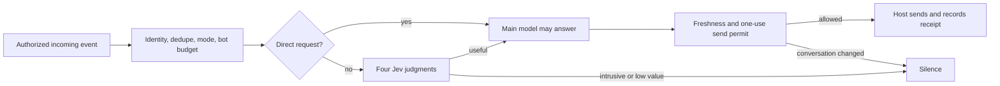

# Jev Chat Gate

**Let an AI agent participate in a group chat without answering everything.**

A small participation gate extracted from our work on a community agent. Jev judges whether a contribution may be useful; your main model writes the answer and can still choose silence. The host owns permissions, identity, and delivery.

Framework-independent JavaScript, Node.js 22+, MIT, zero runtime dependencies. Bring your own chat transport and answering model. This project is independent of TypeSafe AI; Jev is their hosted model, not an open-source model included here.



## Try it

```sh
git clone https://github.com/pandore/jev-chat-gate.git
cd jev-chat-gate
npm test
npm run demo
```

The demo uses synthetic scores and conversation text. No credentials, installation step, or network access required. To evaluate those same synthetic examples with Jev, set `TYPESAFE_API_KEY` in your environment and run `npm run demo -- --live`. This consumes provider quota; it never posts chat messages.

Install in another project from the GitHub release tag:

```sh
npm install github:pandore/jev-chat-gate#v0.1.0
```

There is no npm registry release in v0.1.0.

## Integrate

```js
import { createChatGate, createJevEvaluator } from 'jev-chat-gate';

const scope = 'my-platform:bot-account:community:thread';
const gate = createChatGate({
  scope,
  profile: 'Explain programming concepts with short examples. Do not offer personal advice.',
  stateFile: './.state/community-thread.json',
  evaluate: createJevEvaluator(), // reads TYPESAFE_API_KEY
});

// Called by your host AFTER authorization and transport metadata validation.
async function onMessage(event) {
  const decision = await gate.admit(event);
  if (decision.action !== 'consider') return;

  try {
    // Implement with your model. An admission is not an obligation to reply.
    const answer = await draftAnswer(event);
    if (!answer || answer.trim() === 'NO_REPLY') {
      await gate.cancel(decision.token);
      return;
    }
    // Recheck immediately before the one outgoing platform message.
    const permit = await gate.takeSendPermit(decision.token);
    if (!permit.allowed) return;
    const sent = await sendMessage({ scope: permit.scope, replyTo: permit.replyTo, text: answer });
    // Only call after confirmed delivery; use the PLATFORM's returned message ID.
    await gate.recordSent(decision.token, { scope: permit.scope, id: sent.id, text: answer });
  } catch {
    await gate.cancel(decision.token);
    // Report via your host's error handling; never blindly retry an uncertain send.
  }
}
```

`draftAnswer` and `sendMessage` are host functions, not package APIs. Keep admitting or observing newer messages while a draft is running: a queue that blocks all ingress until generation ends cannot notice intervening replies. Fail closed on rejected gate calls; do not catch an error and proceed to generation or sending.

An input event has this explicit contract:

```js
const event = {
  scope: 'my-platform:bot-account:community:thread',
  id: 'platform-message-42',
  authorId: 'platform-user-7',
  authorKind: 'human', // human | bot | unknown | self
  text: 'Can someone explain when a queue is useful?',
  replyTo: null, // platform message ID, or null/omitted
  addressedToAgent: false, // trusted mention / direct-chat routing from your host
  addressedToOther: false, // explicit address to another participant
};
```

Scope must distinguish **platform, bot account, conversation, and thread**. Use one gate and one state file per scope. Do not construct events from model-generated JSON. Self echoes must be marked `self`; an agent name in text is not identity evidence. See the [integration contract](docs/integration.md) for platform mapping and failure handling.

## Decisions

Direct requests and replies to confirmed own messages bypass Jev. Dedupe, mode, and the confirmed-bot budget still apply. Ambient messages use four independent Noul probabilities:

| Signal | Meaning |
| --- | --- |
| `human_exchange` | An unsolicited contribution would intrude on other participants. |
| `already_answered` | The specific question has an adequate answer already. |
| `unresolved_request` | There is an open, unanswered request to the group or assistant. |
| `distinctive_value` | The assistant can contribute something concrete within its capabilities. |

The returned action is `consider` or `ignore`, with a reason. `consider` includes a host-only token; it neither sends a message nor grants tool permissions. Validated ambient results also include the four scores.

Default policy: veto at `0.82`; unresolved requests need `0.75` with veto below `0.60`; distinctive value needs `0.72` with veto below `0.65`. A recent same-person dialogue can use a request threshold of `0.55`, provided human-exchange probability is below `0.65` and the overall veto stays below `0.82`. Another person's reply is not automatically a follow-up.

These are starting values from one community, **not universal calibration**. Override individual values with `thresholds`; exported `DEFAULT_THRESHOLDS` lists all names. Tune the capability `profile` first, then review false interruptions and missed opportunities on consented examples. Do not judge success only by reduced model calls.

## Controls and limits

| API / option | Behavior |
| --- | --- |
| `admit(event)` | Observes and routes one incoming message; duplicates are ignored. |
| `observe(event)` | Adds context and invalidates stale pending output without evaluation. |
| `setMode('normal')` | Direct and ambient participation. |
| `setMode('quiet')` | Direct requests only. |
| `setMode('off')` | No new text participation, including direct requests. |
| `takeSendPermit(token)` | Checks freshness and consumes one send attempt before transport. |
| `recordSent(token, receipt)` | Records only a confirmed delivery for future dialogue context. |
| `cancel(token)` | Abandons an unclaimed run, including when the main model chooses silence. |
| `timeoutMs` | Evaluator deadline, default 8 seconds. |
| `replyTtlMs` | Admission/continuation freshness, default 3 minutes. |
| `botBudget`, `botWindowMs` | Default 2 admitted/pending bot turns per scope per 10 minutes. |
| `redact(text)` option | Replace the default best-effort text filter before storage/evaluation. |

Only trusted host code may change modes. The package does not interpret chat commands or authorize operators. A mode change invalidates outstanding unclaimed permits, including direct requests.

State is a bounded, atomically replaced JSON file: about 40 history messages / 2 hours, 200 runs / 2 hours, 2,000 dedupe and own-message records / 24 hours (plus the current insertion). With no `stateFile`, state is memory-only and lost on restart. A corrupted or mismatched file throws; it is not silently reset. One process and one gate instance must own each file. For shared workers, use transactional storage in your host integration.

For ambient drafts, the final check suppresses observed reply-branch changes and unthreaded same-author continuations. Direct drafts keep their explicit invitation and skip those two checks. All drafts are subject to expiry and policy changes. Invalidations survive history pruning and restart. A claimed send is never automatically retried: a crash between claim and send can lose a reply. This is **not exactly-once delivery** or an atomic fence against a new event arriving after the check. Keep transport calls adjacent to permit consumption.

## Privacy and release scope

The provider receives the capability profile and up to 12 text messages, with transport IDs replaced by local aliases. The default filter masks common URLs, handles, emails, token patterns, code blocks, and long numbers; it cannot reliably remove all sensitive information. Review what your community permits sharing, and replace the filter or evaluator where needed. Local state contains source IDs and filtered message text; keep it private. The library does not log content or credentials.

v0.1.0 provides text participation, dialogue continuity, deterministic controls, a Jev HTTP adapter, and an offline demo. It does not include channel SDKs, a stock OpenClaw plugin, model prompting orchestration, message batching, automatic roles, or emoji delivery. The broader [participation approach](docs/approach.md) explains how those fit without making them dependencies of the core.

This is an extracted reference implementation. The tests cover routing/lifecycle invariants and a stubbed HTTP contract, not real-world conversational quality or platform end-to-end delivery. The live Jev demo is opt-in. Validate your own adapter with platform receipts before enabling ambient replies.

Protocol references: [TypeSafe API](https://docs.typesafe.ai/api), [Noul semantics](https://docs.typesafe.ai/primitives/noul). No provider code or model weights are bundled; provider access remains subject to its terms.

## Contributing

Use a focused pull request with a runnable regression example for behavioral changes. Run `npm test` and `npm run demo`; there is no build step. Use synthetic conversations only. Never submit credentials, raw community exports, or deployment state in an issue or PR. MIT covers the code in this repository; see [LICENSE](LICENSE).
